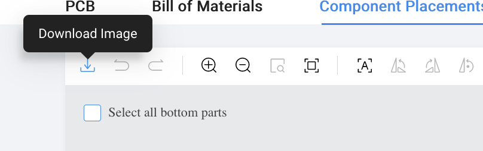

# Ordering keyboard PCBs from JLCPCB

Ordering PCBs from JLCPCB is easy but can be initmitating for the first few times. Keyboard PCBs are the focus of this article and they generally don't require the more advanced options.  We will explain some of the options here and how avoid the common mistakes.

## Uploading files

Landing page

Uploading file

The gerber files are typically compressed into `gerber.zip` file.

Upload, and it may take a minute to process. Occasionally, the preview doesn't work and it's not a concern. If you are not feeling confident, you can use [pcbway's online viewer](https://www.pcbway.com/project/OnlineGerberViewer.html) for a quick preview to make sure that the gerber files are correct.

**Important options**

`layers`: this should be detected, most keyboard projects only uses 2 layers
`dimensions`: when the preview doesn't work, you will have to enter the dimensions of the board. Hopefully, the author of the pcb will provide you the dimensions. If not, you'll have to measure it yourself in kicad.

## PCB specs

There are a lot of options here, but the default should work well.

* `thickness`: 1.6mm is typical. 1.2mm if you want something flexible.
* `color`: personal preference
* `surface finish`: `HASL (with lead)` is the cheapest and is totally functional. I perfer the lead-free finish as I don't like having lead in my home. `ENIG` is a more precise gold-plated finish and adds significant cost if you are only ordering prototypes, but it's a great option for production runs.
* `remove order number`: JLCPCB will put the order number randomly on your PCB. If you want them removed, you can choose `yes` for a small fee. I choose the free `specify a location` option typically, which means JLCPCB will put the order number where the text "JLCJLCJLCJLC" is on PCB.

If you will be soldering all the components yourself, then you're ready to place the order!

## PCB Assembly

PCB assmebly can be a bit more complicated. But it's a great service and it's very inexpensive so it's worth learning.

`PCBA type`: Economic is inexpensive, and will work for most keyboard projects.
`Aseembly side`: Economic PCBA will allow placing components on one side. Choose the side where most of the components are.
`ConfConfirm Parts Placement`: for a small fee, you get a high resolution preview to confirm the placement of the components immediately after order. This is an option I highly recommend because it makes spot checking any mistakes much easier. Otherwise, you will be waiting for their staff to check and get confirmation over email across timezones.

## Bill of Material (BOM) and Component Placement List (CPL)

BOM is a list of components, along of their reference and component specifications. CPL is where those components should be placed on the board. JLCPCB has a [tutorial](https://jlcpcb.com/help/catalog/22-Generate-BOM-%26-CPL) on how they should be formatted. Hopefully, the project author will make them available. Otherwise, this will be covered in a future tutorial.

This is what we see after clicking confirm on the previous page. Even if the preview doesn't render, it's fine here. Click "next", and upload the BOM and CPL csv files.

After the BOM and CPL is processed, you will see a list of components. A properly prepared BOM should have all the components with footprint and values that make it easy to search for parts.  Even better is when the LSCS part numbers are pre-specificed so that there is no ambiguity.

Here is a component with the value "DNP". It's a placeholder component that is meant to be unpopulated.

If you click "Next" when there are un-selected parts, choosing "Do not place" means that you will acknowledge that those components will not be populated.

Occasionally, LCSC will not have enough stock for the parts that are specificed in the BOM. Ask for more help if you don't understand how to choose replacement.

## Confirming component placement

At this step, you should be able to see a preview for the pcb and the components, even if the preview has failed in all the previous steps. Choose the side that you will be getting components placed, and make sure
that it roughly looks like a PCB. Do not proceed otherwise!

For initial inspection, the easiest way is to download the high resolution image, instead of panning around with their interactive tool.

Next, we will zoom in on each component and make sure that they are placed correctly by clicking on each row on the table on the right. Non-polarized components such as resistors will not have any markings on them, so make sure that they are located and rotated correctly. Hopefully, these are all already prepared for you but you **must** confirm. Sometimes you may have to move the component a bit to see the silkscreen marker is.

ICs and polarized parts such as diodes will have marking on them. Make sure that the component marker lines up with the silkscreen maker.

#### Useful commands
You can make adjustments to the location using arrow keys, and rotate them using the "space" key.
"A" and "Z" to zoom in and out.
"Ctrl" + mouse click/drag to pan.

#### Incorrect component placement examples

Dot not aligning with the long silkscreen line. Legs not matching with the pads.

Diode line doesn't match silkscreen.

#### Correct component placement examples

Fixed by rotating 180 degrees

Diode polarity fixed.

Dot lines up with the long line

## Final remarks
Hopefully this had made the process of order PCBs easier for your next project. Next time we will go over how to prepare the BOM and CPL files if they are unavailable.
